# Phase 1 — Domain Foundation

Standing up the first domain controller of a new Active Directory forest,
`lab.local`, on VirtualBox. This is the identity backbone every later component
(vaulting, rotation, session recording, tiering) builds on.

## Environment

| Item        | Value                                              |
|-------------|----------------------------------------------------|
| Hypervisor  | Oracle VirtualBox                                  |
| VM          | DC01 — 4 GB RAM, 2 vCPU, 60 GB VDI                 |
| Guest OS    | Windows Server 2025 Standard (Desktop Experience)  |
| ISO build   | 26100.32230 (SERVER_EVAL_x64FRE_en-us)            |
| Lab network | VirtualBox NAT Network `LabNet`, `10.10.10.0/24`, DHCP disabled |
| DC address  | `10.10.10.10` static, gateway `10.10.10.1`, DNS → self |
| Domain      | `lab.local` (NetBIOS `LAB`)                        |

## Steps

### 1. Lab network

Created a VirtualBox **NAT Network** `LabNet` (`10.10.10.0/24`, DHCP disabled) so
the lab VMs share a private subnet with internet egress and static addressing.
NAT Network (not plain NAT) is required so VMs can reach each other; DHCP is
disabled because domain controllers need fixed addressing.

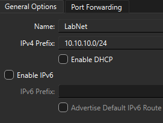

### 2. Virtual machine

Created DC01 (4 GB RAM, 2 vCPU, 60 GB dynamically allocated VDI) and attached its
network adapter to `LabNet`.

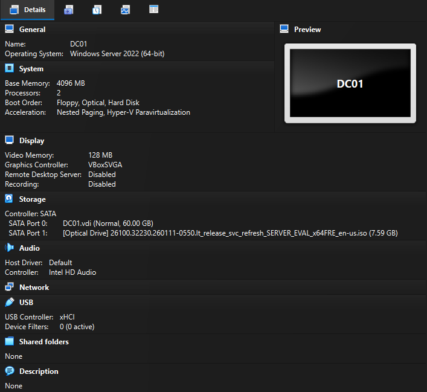

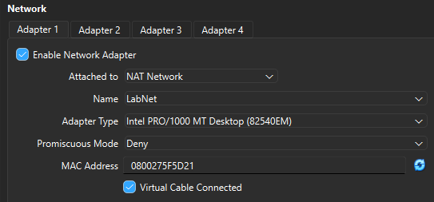

### 3. Operating system

Installed **Windows Server 2025 Standard (Desktop Experience)** — the full
graphical edition, chosen over Server Core so the graphical AD management tools
are available for hands-on work.

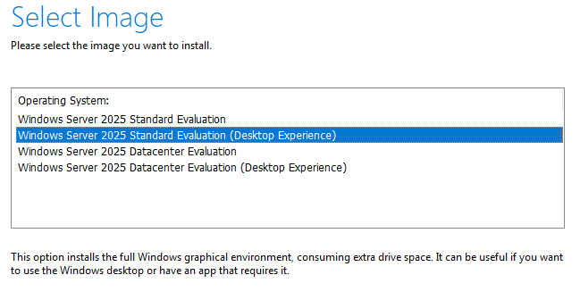

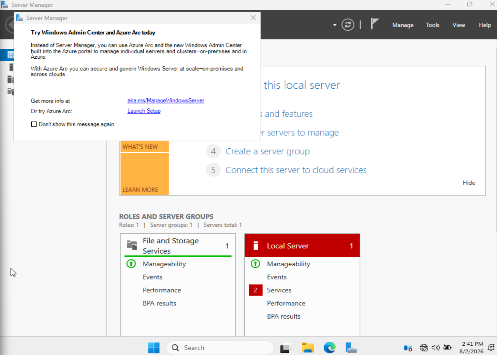

### 4. Guest Additions

Installed VirtualBox Guest Additions for display and mouse integration.

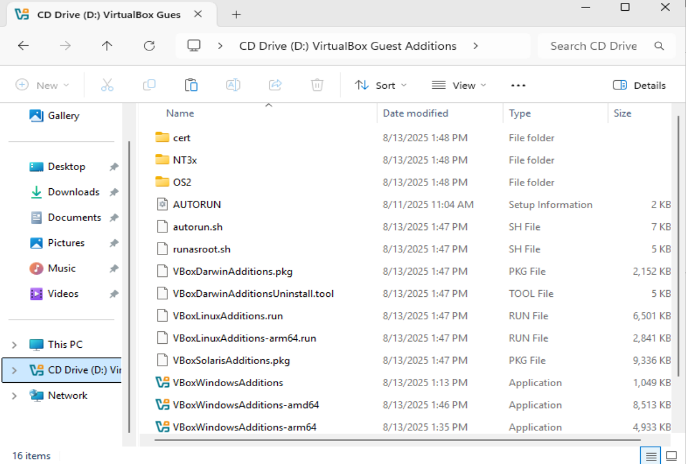

> **Gotcha:** the first reboot after Guest Additions hung on the "Restarting"
> screen for 15+ minutes. A single `Machine → Reset` cleared it; the rename and
> drivers both survived. Non-recurring.

### 5. Rename

Renamed the machine to `DC01` while still in `WORKGROUP` — safe and reversible
before promotion (the name only locks in once the machine becomes a DC).

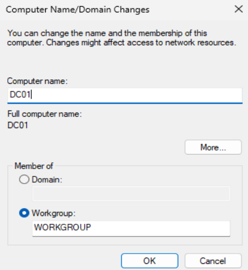

### 6. Static IP

Set `10.10.10.10 / 255.255.255.0`, gateway `10.10.10.1`, preferred DNS
`10.10.10.10` (self).

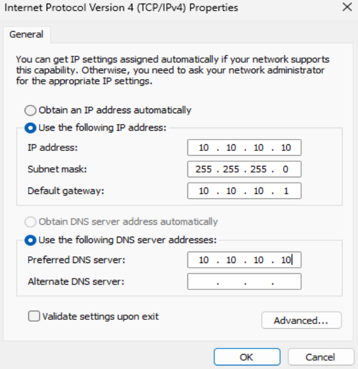

> **Gotcha:** the first attempt reverted to an APIPA address (`169.254.x.x`)
> because only the inner IPv4 dialog was closed, not the outer adapter Properties
> box — the config only writes when **both** close with OK. Reapplied via
> `ncpa.cpl`, closed both dialogs, and verified.

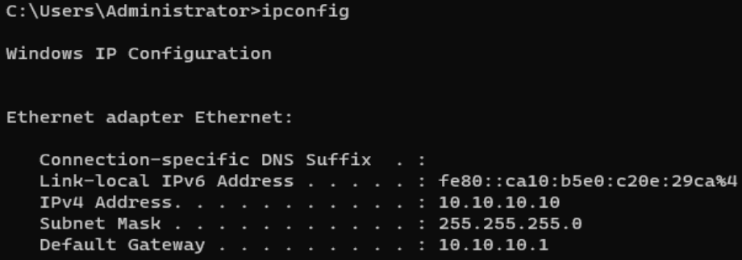

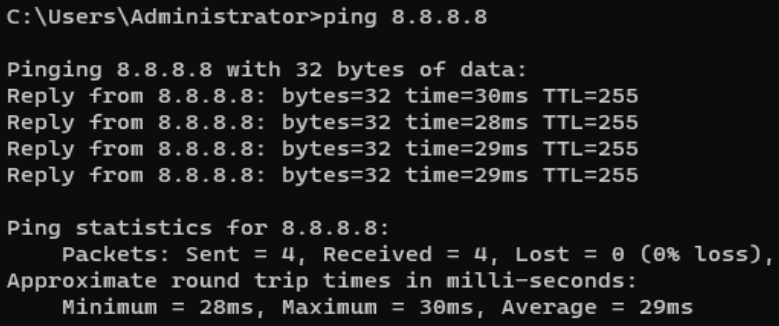

### 7. AD DS role

Installed the **Active Directory Domain Services** role via Server Manager →
Add Roles and Features.

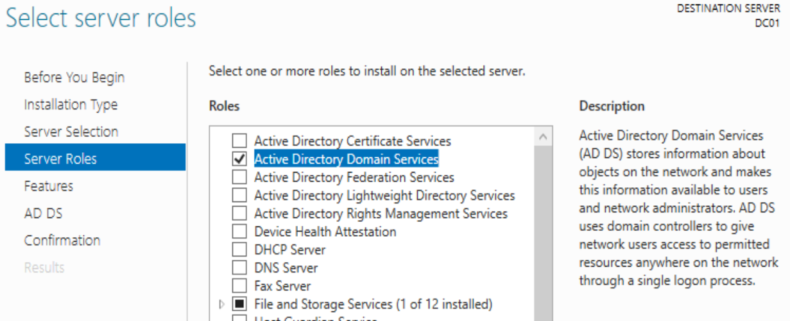

> **Note:** Server Manager's server pool briefly displayed the stale APIPA
> address after the IP fix; a refresh corrected the display — the live adapter
> config was already correct. Installing the role does not make the server a DC;
> that is the separate promotion step below.

### 8. Promotion

Promoted DC01 as the first DC of a **new forest** `lab.local`: DNS server
enabled, default functional levels, separate DSRM password. Passed the DNS
delegation warning (expected for a `.local` forest with no internet parent zone).
The server auto-rebooted to complete promotion.

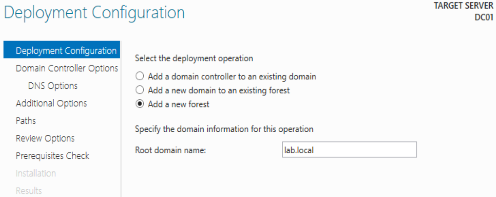

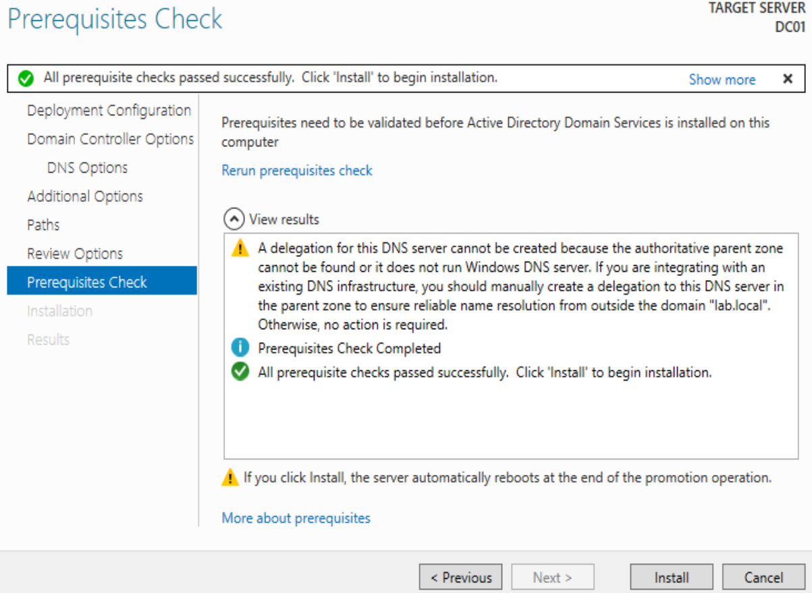

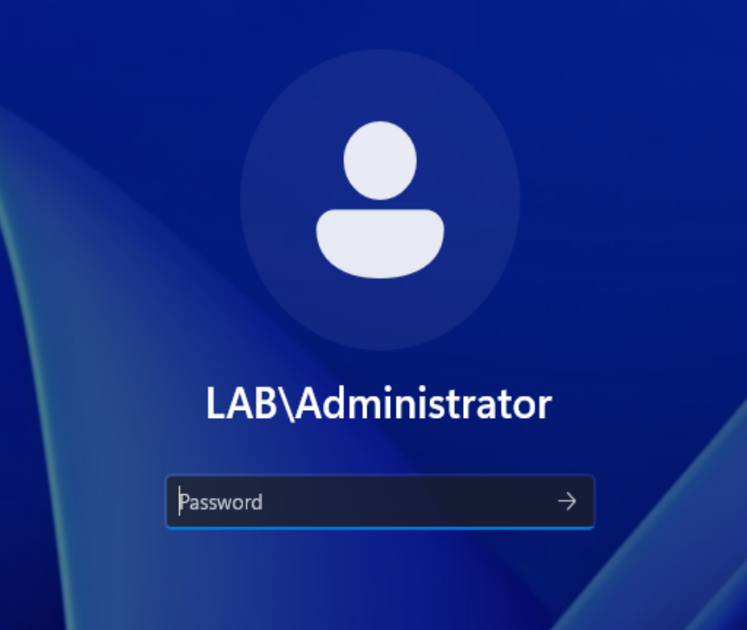

## Validation

Confirmed the DC is healthy rather than merely booted.

| Check                                   | Result                                        |
|-----------------------------------------|-----------------------------------------------|
| SRV record lookup (`_ldap._tcp.dc...`)  | Returns `dc01.lab.local` @ `10.10.10.10:389`  |
| `Get-ADDomainController`                | DC01 / lab.local / lab.local / 10.10.10.10    |
| External resolution (`nslookup google.com`) | Resolves (DC forwards external DNS)       |
| `dcdiag /test:ridmanager /v`            | Passed test RidManager                        |
| Functional RID test (`New-ADUser`/`Remove-ADUser`) | Succeeded — RID pool issuing IDs   |
| RID error events in log (ID 16650)      | None found (transient boot noise, cleared)    |

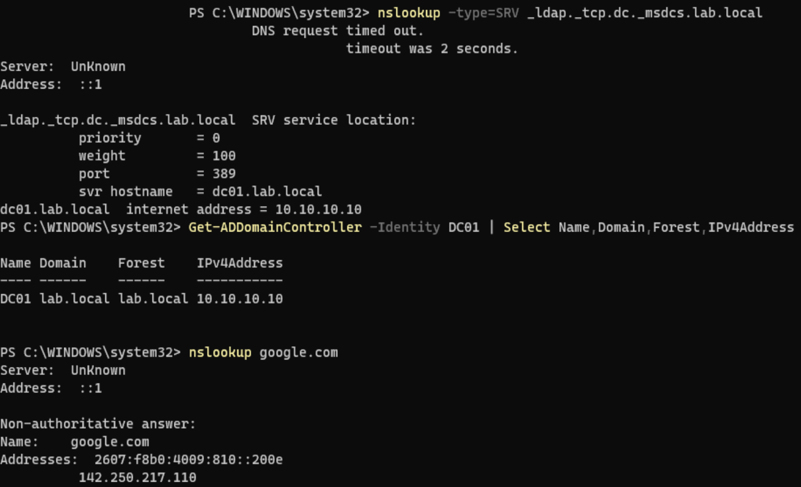

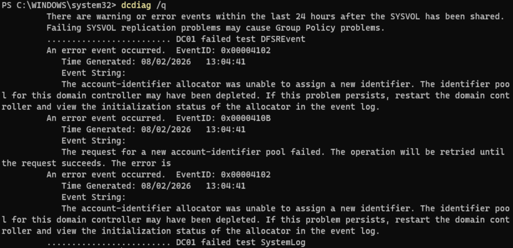

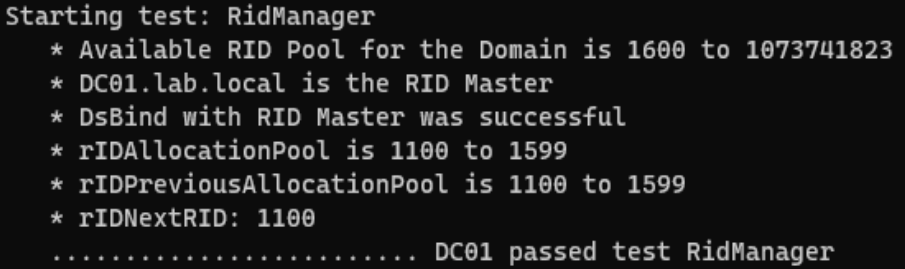

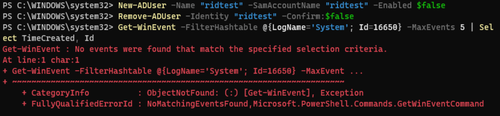

**Note on dcdiag.** Initial `dcdiag /q` reported RID-allocator and DFSR errors
timestamped at boot. These are transient first-boot events on a fresh single-DC
forest; `dcdiag`'s SystemLog/DFSREvent tests scrape the last 24 hours of log
history, so they keep echoing old events even after resolution. Confirmed genuine
health via the live `RidManager` test and by functionally creating/deleting an
AD user — the more reliable signal than a log summary.

## Outcome

A validated, healthy domain controller for `lab.local`: SRV records registered,
directory queryable, DNS resolving internally and externally, RID pool issuing
identifiers. Foundation ready for the tiered administration model (Phase 2).
