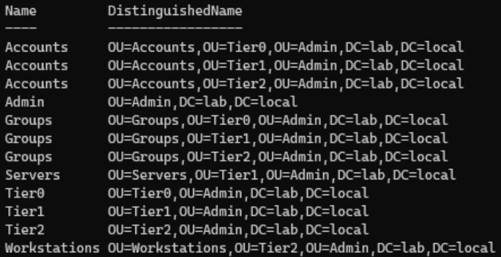
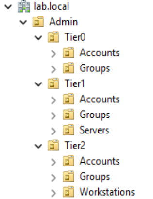
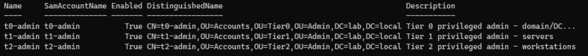
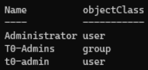
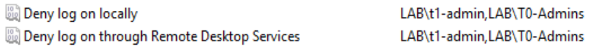
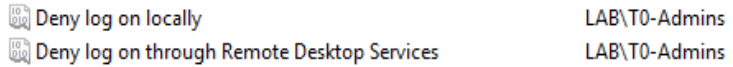
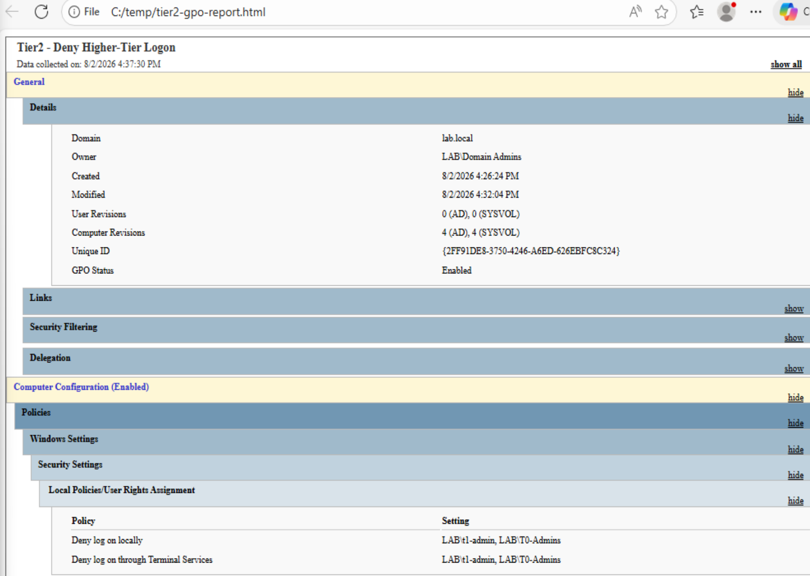
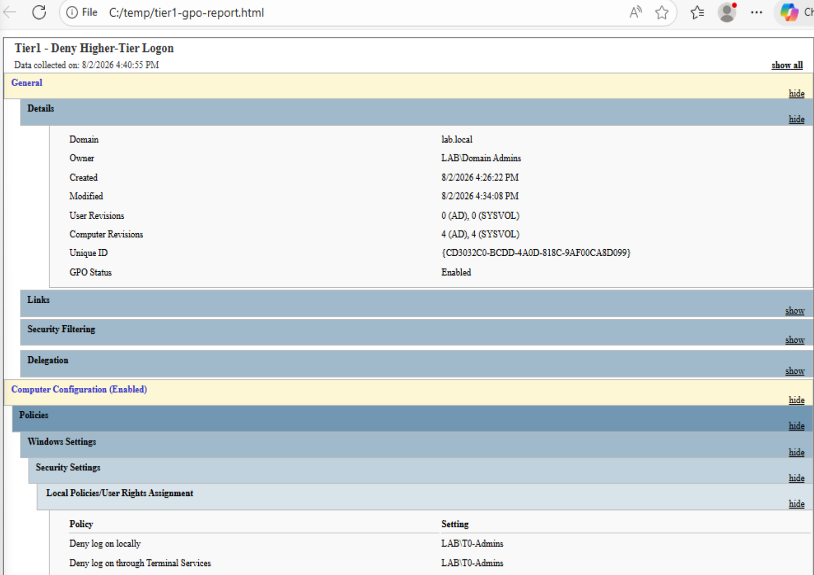

# Phase 2 — Tiered Admin Model

Implementing Microsoft's Active Directory administrative tier model on
`lab.local`: an OU structure, dedicated per-tier admin accounts, an RBAC role
group, and deny-logon GPOs that confine each tier. This is the least-privilege
core of the lab.

## Why tiering

Credentials cache in memory on any machine you log into — that's how single
sign-on works, and it's also the weakness. If a Domain Admin logs into a
compromised workstation, that privileged credential can be stolen from memory
(pass-the-hash / pass-the-ticket) and replayed to take over the domain. One
infected laptop becomes full domain compromise. This is the dominant real-world
AD attack path.

The tier model breaks the pivot by separating privilege by blast radius:

| Tier | Scope | Compromise impact |
|------|-------|-------------------|
| Tier 0 | Domain controllers, AD, identity infrastructure | Whole-domain takeover |
| Tier 1 | Servers and business applications | Contained to those systems |
| Tier 2 | Workstations and user devices | Contained to endpoints |

**The rule:** a higher-tier credential may never log on to a lower-tier machine.
Each tier gets its own admin accounts, and higher-tier accounts are explicitly
denied logon to lower tiers — so compromising a workstation yields no credential
that reaches the domain.

## Steps

### 1. OU structure

Built the tier OU tree with PowerShell (repeatable, self-documenting,
infrastructure-as-code). Each OU is protected from accidental deletion. Layout: a
dedicated `Admin` branch with `Tier0/Tier1/Tier2`, each holding `Accounts` and
`Groups`, plus `Servers` (Tier1) and `Workstations` (Tier2).
Script: [`scripts/01-create-ou-structure.ps1`](../scripts/01-create-ou-structure.ps1)

### 2. Tiered admin accounts

Created `t0-admin`, `t1-admin`, `t2-admin`, each in its tier's `Accounts` OU.
Passwords are prompted as SecureStrings at runtime — never hardcoded, so no
credential lands in the script, shell history, or repo.
Script: [`scripts/02-create-tiered-admins.ps1`](../scripts/02-create-tiered-admins.ps1)

### 3. Tier 0 role group (RBAC)

Rather than adding `t0-admin` directly to Domain Admins, used a role-group
pattern: `t0-admin → T0-Admins (role) → Domain Admins (built-in privilege)`. This
is RBAC — entitlements are auditable ("who is in T0-Admins?"), access reviews are
simple, and privilege is managed without touching built-in groups directly.
Script: [`scripts/03-create-t0-role-group.ps1`](../scripts/03-create-t0-role-group.ps1)

### 4. Deny-logon GPOs (enforcement)

The enforcement mechanism is Windows **Deny log on** user rights, delivered by
GPO and linked to each tier's machine OU. Deny always overrides allow in Windows,
so the block is absolute. Both interactive (**Deny log on locally**) and remote
(**Deny log on through Remote Desktop Services**) logon are denied — a partial
control that closes only one path leaves a door open.

GPO creation and linking is scripted; the User Rights Assignment values are set
in the Group Policy Management Editor (populating those rights in raw PowerShell
means editing security template files, so the GUI is the cleaner path).
Script: [`scripts/04-create-deny-logon-gpos.ps1`](../scripts/04-create-deny-logon-gpos.ps1)

**Tiering matrix:**

| GPO (linked to) | Deny logon (local + RDP) for |
|-----------------|------------------------------|
| Tier2 → Workstations | `T0-Admins` **and** `t1-admin` |
| Tier1 → Servers | `T0-Admins` only |

## Validation

Live denial requires a target machine (Phase 3). Validated here that the policy
exists, is correctly populated, and is linked and enabled.

- `Get-GPInheritance` on both machine OUs: each Deny GPO linked, `Enabled: True`.
- GPO HTML reports confirm the User Rights Assignment values on each GPO.

> **Note.** GPO reports label the RDP right "Deny log on through Terminal
> Services"; the GUI editor calls it "Deny log on through Remote Desktop
> Services." Same right (`SeDenyRemoteInteractiveLogonRight`) — legacy vs. current
> naming. `Enforced: False` on both links is correct: no competing GPO needs
> overriding, so `Enabled` is sufficient.

## Outcome

The tier model is fully engineered: OU structure, per-tier admin accounts, an
RBAC role group carrying Tier 0 privilege, and deny-logon GPOs (both logon types)
linked and enabled on the Tier 1 and Tier 2 machine OUs. The remaining piece —
demonstrating a live denial of a Tier 0 admin on a Tier 1 server — is carried out
in Phase 3, once a member server exists to enforce against.
