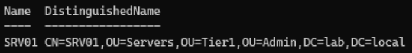
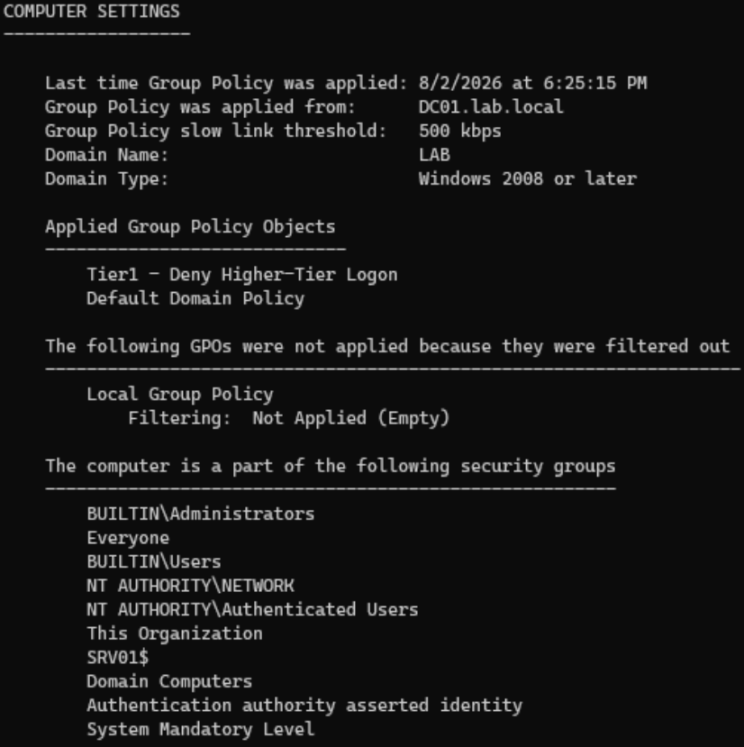
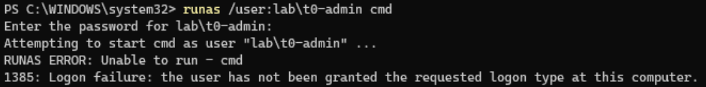
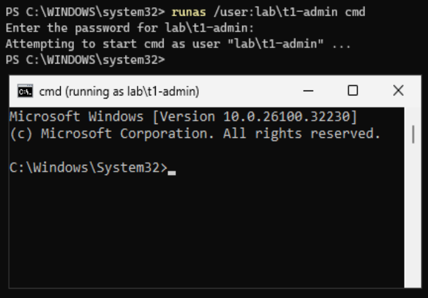

# Phase 3 — Member Server & Tiering Proof

Standing up a domain-joined member server (SRV01), placing it in the Tier 1 OU,
and proving the tier model works end to end: a Tier 0 admin is denied logon while
a Tier 1 admin is permitted, on the same server.

## Why a member server

A domain is meaningless with one machine. The point of AD is centralized identity
across many machines that trust the DC. A **member server** is a machine joined to
the domain but not a DC — it trusts the DC for authentication, applies Group
Policy pushed from the DC, and hosts workloads. It's also the realistic target for
the PAM work in later phases (something to vault credentials for and broker
sessions to).

Joining a machine to the domain creates a **computer account** in AD (machines are
security principals too), establishes a **secure channel** to the DC, and starts
the machine **pulling Group Policy**. So placing it in the right tier OU means it
inherits that tier's security policy automatically — no per-machine config.

## Environment

| Item        | Value                                   |
|-------------|-----------------------------------------|
| VM          | SRV01 — 4 GB RAM, 2 vCPU, 60 GB VDI      |
| Guest OS    | Windows Server 2025 Standard (Desktop)  |
| Network     | `LabNet`, static `10.10.10.20`          |
| DNS         | `10.10.10.10` (the DC — required for join) |
| Role        | Domain member server in `lab.local`     |

## Steps

### 1. Network — point DNS at the DC

Unlike the DC (which points DNS at itself), a domain client must use the DC for
DNS so it can resolve the domain's SRV records and find a DC to join. Set SRV01 to
static `10.10.10.20`, gateway `10.10.10.1`, **preferred DNS `10.10.10.10`**.
Verified with `ping 10.10.10.10` (replies from the DC).

### 2. Domain join

Joined with PowerShell, authorizing with the Tier 0 account (joining a machine is
a Tier 0 operation):

```powershell
Add-Computer -DomainName "lab.local" -Credential (Get-Credential) -Restart
```

`Get-Credential` prompts securely rather than embedding credentials.

> **Gotcha:** the VM was named `SRV01` in VirtualBox, but the Windows computer name
> was still the default `WIN-XXXXX`, so it joined under that name. Fixed cleanly
> while joined with `Rename-Computer -NewName "SRV01" -DomainCredential
> (Get-Credential) -Restart`, which renames both the machine and its AD computer
> account in one step (no orphaned account left behind).

### 3. Move SRV01 into the Tier 1 OU

Newly joined machines land in the default `CN=Computers` container, which is **not**
a policy-linkable OU. Moved SRV01 into the Tier 1 Servers OU so it inherits the
Tier 1 deny-logon GPO:

```powershell
Get-ADComputer -Identity "SRV01" |
  Move-ADObject -TargetPath "OU=Servers,OU=Tier1,OU=Admin,DC=lab,DC=local"
```



### 4. Apply and confirm policy

Forced a policy refresh (`gpupdate /force`) and confirmed the Tier 1 deny GPO
actually reached SRV01 with `gpresult /r` — "Tier1 - Deny Higher-Tier Logon"
appears under applied Computer GPOs, sourced from `DC01.lab.local`.



## The proof — denial and permit

Tested the boundary with `runas`, which triggers the same logon-rights check as a
full login. The distinction demonstrated here is **authentication vs.
authorization**: in the denial case the credentials are valid (authentication
succeeds) but the logon right is denied (authorization fails).

**Tier 0 admin — denied:**

```
runas /user:lab\t0-admin cmd
→ 1385: Logon failure: the user has not been granted the requested logon type
  at this computer.
```

The password was accepted; the logon *right* was denied by the Tier 1 deny GPO.
Error 1385 is authorization failing, not authentication.



**Tier 1 admin — permitted:**

```
runas /user:lab\t1-admin cmd
→ opens a working cmd session running as lab\t1-admin
```

Same server, same test — allowed, because the Tier 1 GPO denies only Tier 0.



The paired result proves the control is **precise**, not a blanket lockout: it
denies exactly the higher tier and permits the correct tier.

## Outcome

The tier model is proven end to end. Threat (Phase 2): cached credentials →
pass-the-hash → domain takeover. Control (Phase 2): tiered accounts + deny-logon
GPOs. Proof (Phase 3): a valid Tier 0 credential denied at a Tier 1 server (error
1385) while a Tier 1 credential is permitted on the same machine. A Tier 0
credential can never be exposed on a lower-tier machine, breaking the lateral-
movement pivot.

Script: [`scripts/05-join-and-tier-srv01.ps1`](../scripts/05-join-and-tier-srv01.ps1)
