# Phase 4 — Credential Vaulting & Rotation (HashiCorp Vault + LDAPS)

Standing up HashiCorp Vault as an open-source analog to CyberArk's vault and
Central Policy Manager, and demonstrating automated Active Directory credential
rotation over an encrypted LDAPS channel. This is the core PAM payload of the
lab.

## Why this matters

Service accounts — the non-human logins software uses to authenticate to other
software — are traditionally set once, hardcoded in config files, and never
rotated, because updating them everywhere is painful. A leaked service-account
password then stays valid indefinitely. A credential vault solves this: it owns
the password, rotates it automatically, and hands it out only to authorized
requesters. CyberArk does this commercially; this phase demonstrates the same
capability with Vault.

Two production PAM patterns are demonstrated:

- **Static role** — a persistent service account whose password Vault owns and
  rotates (the workhorse pattern).
- **Check-out / check-in library** — a pool of shared privileged accounts that
  are borrowed and returned, with automatic rotation on return (the shared-
  privileged-account pattern).

Plus **root credential rotation** — Vault takes over its own bind account's
password so no human knows it.

> **Community vs. Enterprise (honest scope).** In Vault 2.x Community edition,
> *unattended, timer-based* automatic rotation of static roles is an Enterprise
> feature. The rotation *mechanism* — Vault connecting to AD over LDAPS and
> changing a password — is fully demonstrated here on Community via manual and
> check-in-triggered rotation. Scheduling it on an interval is a licensing flag
> on top of the identical configuration, not a different capability.

## Environment

| Item        | Value                                             |
|-------------|---------------------------------------------------|
| Vault host  | SVC01 — Ubuntu Server 24.04, `10.10.10.30`        |
| Vault       | v2.0.3, file storage, TLS listener, systemd service |
| DC / LDAPS  | DC01, `ldaps://dc01.lab.local` (port 636)         |
| CA          | `lab-DC01-CA` — AD CS Enterprise Root CA on DC01   |
| Bind account| `svc-vault` (Tier 0) — delegated Reset Password    |
| Targets     | `svc-app01` (static role); `svc-shared01/02` (library) |

## Part 1 — Vault install and initialization

Installed Vault from HashiCorp's APT repo (GPG-verified), running as a systemd
service with file storage and a TLS listener. Initialized with
`vault operator init`, producing 5 unseal key shares (threshold 3) and a root
token, then unsealed with 3 shares and logged in.

Key concept — **seal/unseal via Shamir's Secret Sharing**: Vault starts sealed
and cannot decrypt its own storage until unsealed. The unseal capability is split
into 5 shares requiring a quorum of 3, so no single person can unseal Vault
alone. Vault re-seals on every restart by design.

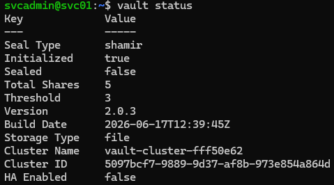

## Part 2 — LDAPS on the domain controller

AD only permits password changes over an encrypted (LDAPS) connection, so the DC
had to offer LDAPS before Vault could rotate anything.

1. Installed the **AD CS** role on DC01 and configured it as an **Enterprise Root
   CA**. Enterprise integration enables automatic certificate enrollment.

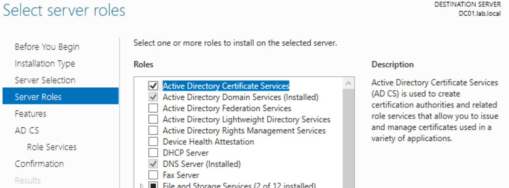

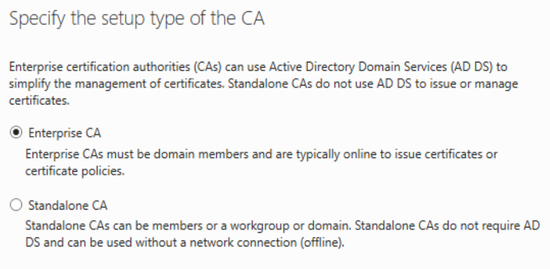
2. The DC auto-enrolled for a Domain Controller certificate (issued by
   `lab-DC01-CA`), enabling LDAPS on port 636.
3. **Verified LDAPS independently** with `ldp.exe` — connected to
   `dc01.lab.local:636` with SSL, confirmed a 256-bit encrypted channel returning
   RootDSE directory data. Proving the AD side worked *before* involving Vault
   isolates any later problem to the Vault side.
4. Exported the CA's public certificate (Base-64, no private key) and placed it
   on SVC01 at `/etc/vault.d/lab-ca.pem` for Vault to trust the connection.

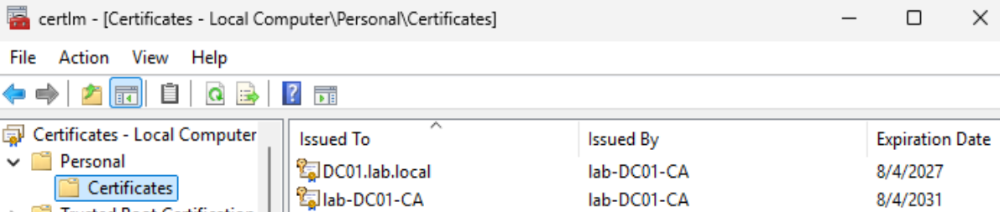

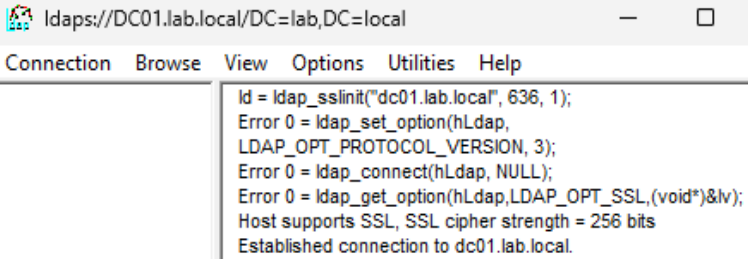

## Part 3 — AD-side accounts and least-privilege delegation

- Created `svc-vault` (Vault's bind account, Tier 0) and `svc-app01` (rotation
  target). Both required strong passwords — a weak password causes `New-ADUser`
  to create the account disabled.
- **Scoping decision (least privilege).** The target service account initially
  shared the `Tier1\Accounts` OU with the `t1-admin` admin account. Delegating
  Reset Password over that OU would have granted the bind account reset rights
  over a privileged admin identity — an over-broad grant. Managed service
  accounts were therefore moved to a dedicated `ServiceAccounts` OU, and the
  Reset Password delegation was scoped there, so the bind account cannot reach
  any admin account.
- Delegated **only** the "Reset Password" right (not "Change Password", not admin
  membership) to `svc-vault` over the `ServiceAccounts` OU.

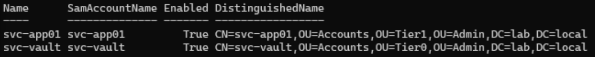

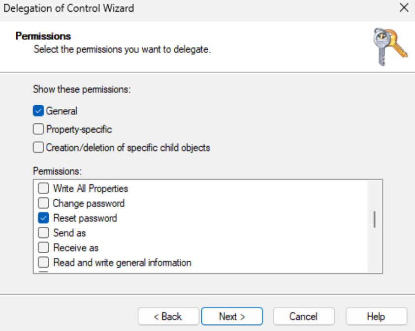

## Part 4 — Vault LDAP secrets engine

Enabled the `ldap` secrets engine and configured it against the DC over LDAPS
with `schema=ad`, the bind account, and the CA certificate
(`insecure_tls=false`, so the DC's certificate is strictly verified).

**Root credential rotation.** Ran `vault write -f ldap/rotate-root` so Vault
changed `svc-vault`'s own password to a value only Vault knows. This required
granting `svc-vault` Reset Password over its own object (via `dsacls`, scoped to
the single object). After this, the setup-time bind password is dead — human
knowledge of the bind credential is eliminated, which also neutralizes any
exposure of that password during setup.

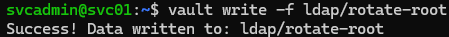

## Part 5 — Static role rotation (persistent service account)

Created a static role mapping Vault to `svc-app01`. Creation triggered an initial
rotation — Vault connected over LDAPS, authenticated as `svc-vault`, and reset
`svc-app01`'s password to a new 64-character value it now holds.

**Proof:** reading `ldap/static-cred/app01-role` returns the current password;
the original password (`apppassword123!`) is rejected by AD with an
authentication error, proving the rotation took effect.

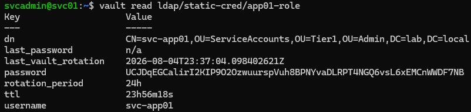

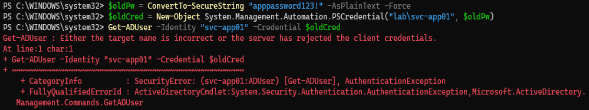

## Part 6 — Check-out / check-in library (shared privileged accounts)

Created a library set (`ops-team`) over `svc-shared01`/`svc-shared02` with a 1h
lending TTL. Demonstrated the full cycle: check-out (Vault hands out an available
account and its current password), status (account shows checked out with a
borrower token), and check-in (Vault returns the account **and automatically
rotates its password**).

> **Config note.** The library performs an LDAP *search*, which requires a
> `userdn` search base — unlike static roles, which use an explicit DN. Adding
> `userdn="OU=Admin,DC=lab,DC=local"` resolved an initial "No Such Object" error.
> The config was updated *without* re-supplying `bindpass`, because after
> rotate-root Vault owns the bind password and uses its internally-held value.

**Proof:** the password handed out at check-out is rejected by AD after check-in,
proving check-in rotated it — the borrower's credential evaporates on return.

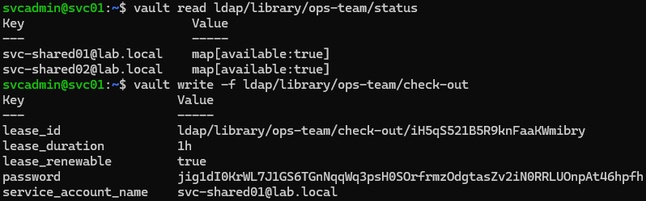

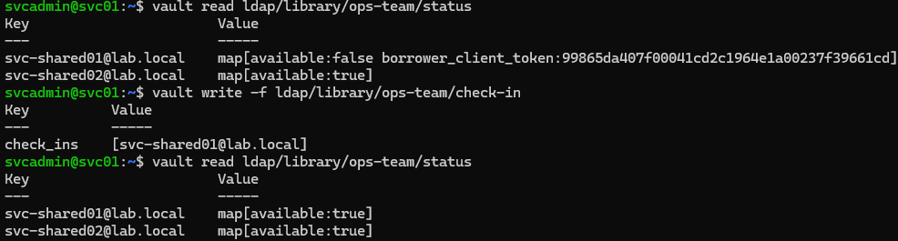

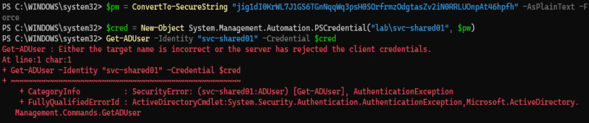

## Outcome

A production-representative PAM demonstration over real LDAPS with real PKI:

- Vault manages AD service-account credentials over an encrypted, certificate-
  verified channel.
- **Static role**: persistent service account rotated; old password dead.
- **rotate-root**: Vault owns its own bind credential; no human knows it.
- **Check-out/check-in library**: shared privileged accounts borrowed and
  returned, auto-rotated on return; borrower's credential invalidated.

Maps directly to Privileged Access Management, password rotation, and credential
lifecycle management, and the AD CS work additionally demonstrates certificate
management / PKI.

Scripts: [`scripts/06-vault-ad-accounts.ps1`](../scripts/06-vault-ad-accounts.ps1),
[`scripts/07-vault-ldap-engine.sh`](../scripts/07-vault-ldap-engine.sh)
