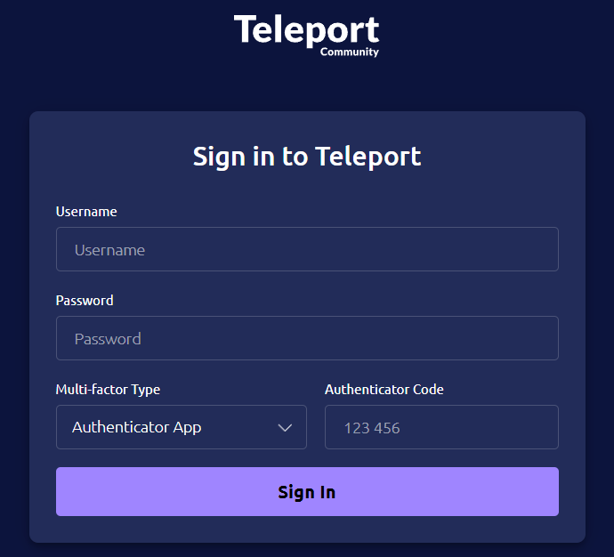
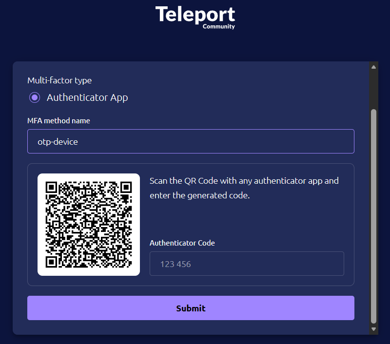
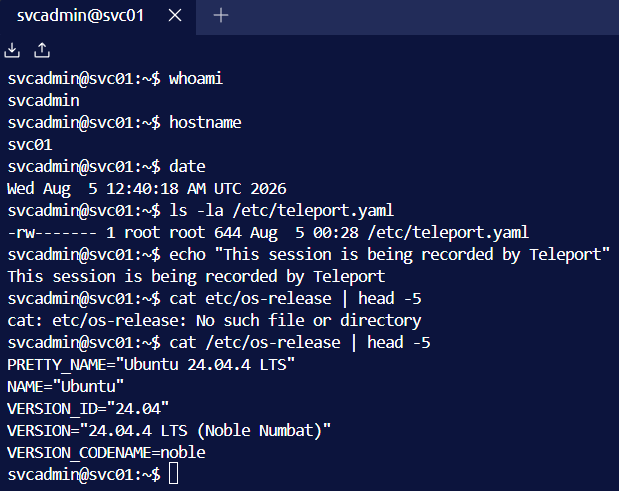
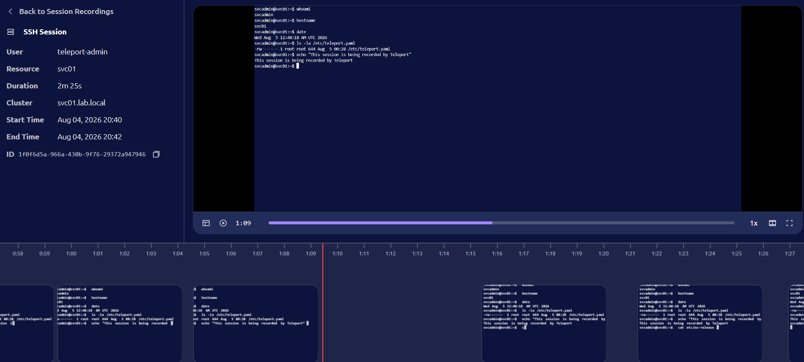

# Phase 5 — Brokered Access & Session Recording (Teleport)

Standing up self-hosted Teleport Community Edition as an open-source analog to
CyberArk's Privileged Session Manager (PSM), and demonstrating brokered,
MFA-protected, fully recorded privileged access to a server.

## Why this matters

Vault (Phase 4) solved *credentials* — what the password is and rotating it.
Teleport solves the other half of PAM: *access and accountability* — who
connected to what, when, as which identity, and what they did. Instead of
engineers holding standing SSH keys and connecting directly, access is brokered
through Teleport, which enforces RBAC, requires MFA, issues short-lived
certificates, and **records the full session** for audit and replay.

This directly addresses the **session monitoring** requirement that credential
vaulting alone does not cover.

## Architecture

Teleport runs three services, all on SVC01 for this single-node cluster:

- **Auth Service** — the cluster's own certificate authority; issues short-lived
  certificates and handles authentication. (Distinct from the AD CS CA, which
  only issues the web TLS cert.)
- **Proxy Service** — the frontend users connect through (web UI + connection
  broker).
- **SSH Service** — the agent on a protected server that enforces access control
  and records sessions.

Access is certificate-based and time-bound rather than static SSH keys — the
Auth Service issues short-lived certs on login.

## Environment

| Item        | Value                                          |
|-------------|------------------------------------------------|
| Host        | SVC01 — Ubuntu 24.04                            |
| Teleport    | v18.10.0, Community Edition                     |
| Cluster     | `svc01.lab.local`                              |
| Web/Proxy   | `https://svc01.lab.local:443` (reachable from host at `192.168.56.101`) |
| Web TLS     | self-signed cert (lab); production would issue from the AD CS CA |
| MFA         | TOTP (authenticator app), enforced by default  |

## Steps

### 1. Install and configure

Installed Teleport via the official installer (`cdn.teleport.dev/install.sh`,
pinned to 18.10.0) — `teleport version` confirms Community Edition (no
"Enterprise" in the output). Generated a TLS cert/key for the proxy (SANs
covering SVC01's FQDN, short name, both IPs, and localhost), then generated the
cluster config with `teleport configure` for a private-network deployment (no
ACME/Let's Encrypt, since the network is isolated). Started Teleport as a systemd
service.

> **Cert note (lab vs. production).** The web TLS cert is self-signed here. In a
> production internal deployment the proxy cert would be issued by the internal
> CA (the Phase 4 AD CS `lab-DC01-CA`), so domain machines trust it without a
> browser warning. This does not affect session recording.

### 2. Create the admin user with MFA

Created `teleport-admin` via `tctl users add` with roles `editor`, `access`, and
`auditor` (auditor is required to view session recordings), and permitted OS
logins `svcadmin`/`root`. Completed the invite: set a password and enrolled a
TOTP authenticator (MFA is enforced by default).

> **Concept.** A Teleport identity maps to a set of permitted OS logins — you
> authenticate as your Teleport user (with MFA), then Teleport authorizes you to
> assume specific OS users on protected hosts. That mapping is the access-control
> layer.

### 3. Brokered, recorded session

SVC01 auto-enrolled as an SSH resource (the SSH Service runs on it). Connected
through the Teleport web terminal as `svcadmin` and ran a series of commands —
the session is brokered through Teleport and recorded automatically.

### 4. Session replay (the deliverable)

The completed session appears in **Session Recordings** with full metadata — user
`teleport-admin`, resource `svc01`, duration, cluster, start/end timestamps, and
a unique session ID — and **replays with original timing**, including a timeline
scrubber. Every command and its output is captured and reviewable after the fact.

## Outcome

A self-hosted Teleport cluster providing brokered, MFA-protected, certificate-
based privileged access with full session recording and replay — the session-
management and accountability half of PAM (CyberArk PSM equivalent). Combined
with Phase 4 (Vault), the lab now covers both halves of privileged access
management: credential vaulting/rotation and session monitoring/audit.

Directly addresses **session monitoring**, and reinforces **MFA on privileged
access** and **certificate-based (keyless) access**.

Reference: [`scripts/08-teleport-setup.sh`](../scripts/08-teleport-setup.sh)
