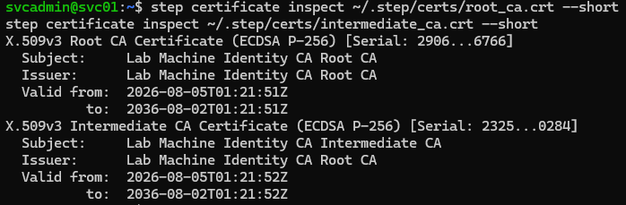
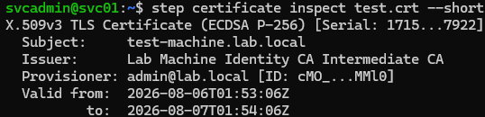
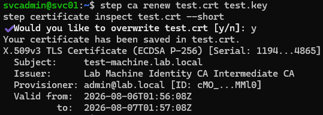
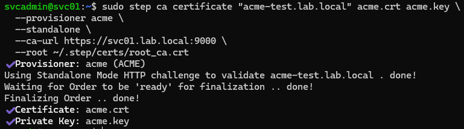

# Phase 6 — Machine Identity & Short-Lived Certificates (step-ca)

Standing up Smallstep `step-ca` as a modern, ACME-enabled certificate authority
issuing short-lived machine identity certificates with automated renewal. This
complements the traditional enterprise PKI built with AD CS in Phase 4 — the two
CAs together show both the long-lived enterprise model and the modern
short-lived/automated model.

## Why this matters

Traditional certificates are valid for years. If one is compromised, it is a
long-term exposure, and revocation depends on clients checking CRLs/OCSP.
**Short-lived certificates** flip this: certs expire in hours and renew
automatically, so a compromised cert is useless within a day and revocation
becomes largely passive (just stop renewing). This is the machine-identity model
used by modern infrastructure — the same principle behind Teleport's short-lived
access certs (Phase 5), applied to service/machine identity.

**Contrast with Phase 4 (AD CS):**

| | AD CS (Phase 4) | step-ca (Phase 6) |
|---|---|---|
| Model | Traditional enterprise PKI | Modern short-lived |
| Cert lifetime | Years (2–5) | 24 hours |
| Renewal | Manual / auto-enroll | Automatic, credential-less |
| Automation | Group Policy enrollment | ACME (Let's Encrypt protocol) |
| Key type | RSA | ECDSA P-256 |

## Environment

| Item     | Value                                          |
|----------|------------------------------------------------|
| Host     | SVC01 — Ubuntu 24.04                            |
| step-ca  | v0.30.2 (server); step CLI v0.30.6             |
| CA URL   | `https://svc01.lab.local:9000`                |
| PKI      | Two-tier: `Lab Machine Identity CA` root + intermediate |
| Key type | ECDSA P-256                                     |

## Two-tier PKI

`step ca init` creates a **two-tier PKI**: a root CA and an intermediate CA. The
root signs the intermediate; the intermediate issues the day-to-day leaf certs.
The root's key is used rarely (only to sign the intermediate), so it stays
safer. The CA certificates are long-lived infrastructure (10-year root), while
the leaf certs they issue are deliberately short-lived (24h).

## Short-lived certificate issuance

Started the CA (`step-ca $(step path)/config/ca.json`), bootstrapped client trust
with the root fingerprint, and issued a machine identity certificate for
`test-machine.lab.local`. Inspecting it shows a **24-hour validity window** —
issued by the intermediate CA, ECDSA P-256.

## Automatic, credential-less renewal

`step ca renew` renews the certificate using the *existing* certificate to
authenticate the request (mutual TLS) — no password, no human step. Inspecting
the renewed cert shows a **new serial number and a validity window shifted
forward**, proving the cert was replaced with a fresh 24-hour identity.

This is what makes short-lived certs practical: once a machine holds an initial
cert, it renews itself indefinitely with no stored credential.

## ACME automation (industry-standard, credential-less)

Added an **ACME provisioner** so the CA speaks the same protocol Let's Encrypt
uses. Issued a certificate for `acme-test.lab.local` in standalone mode: the
client answered an **http-01 challenge** proving it controls the identity, the CA
validated it by connecting back to the target, and issued the cert — with no
password.

> **Lab note.** The CA validates a challenge by connecting back to the claimed
> identity, so the name must resolve to the responder. Added a hosts entry
> (`acme-test.lab.local` -> 127.0.0.1) so the on-box CA could reach the standalone
> challenge server. In production this is real DNS.

**Concept.** ACME replaces credentials with proof-of-control challenges — the CA
asks the client to prove it controls the identifier (serve a token at a known
URL for http-01), and only something actually controlling that identity can
answer. That is why machines can obtain and renew certificates with zero human
involvement — the model behind public web PKI, applied to internal
infrastructure.

## Outcome

A modern machine-identity CA: two-tier PKI issuing 24-hour ECDSA certificates
with credential-less automatic renewal and full ACME automation. A compromised
cert expires within a day (passive revocation), and issuance/renewal are
hands-off.

Together with the AD CS enterprise PKI (Phase 4), the lab demonstrates both the
traditional long-lived enterprise model and the modern short-lived/ACME model —
covering **certificate management** and **machine identity management**.

Reference: [`scripts/09-stepca-setup.sh`](../scripts/09-stepca-setup.sh)
